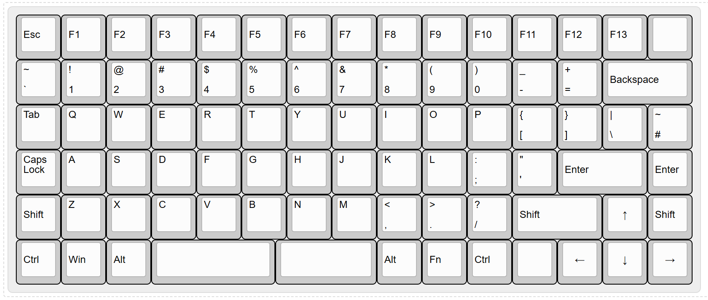
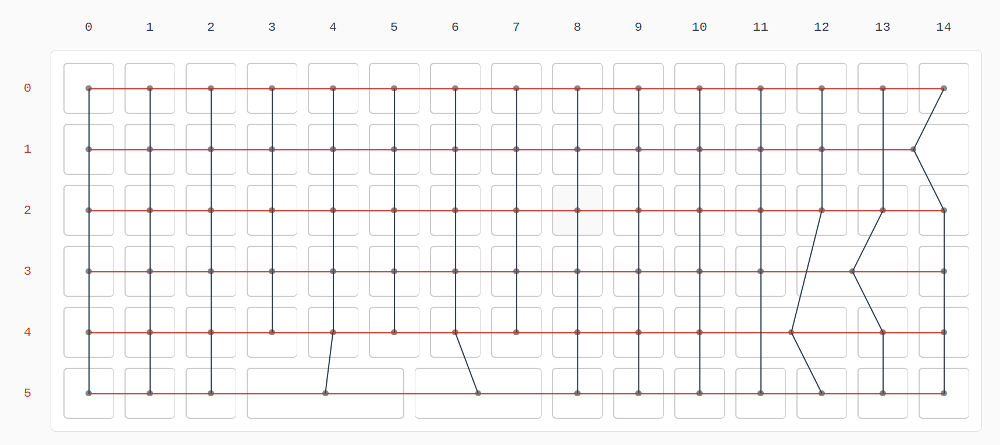
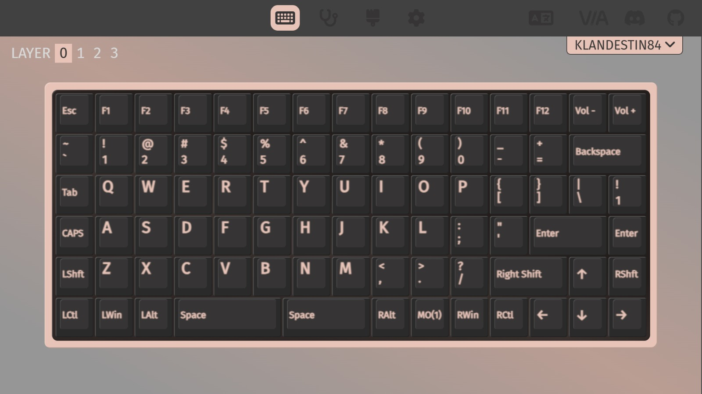
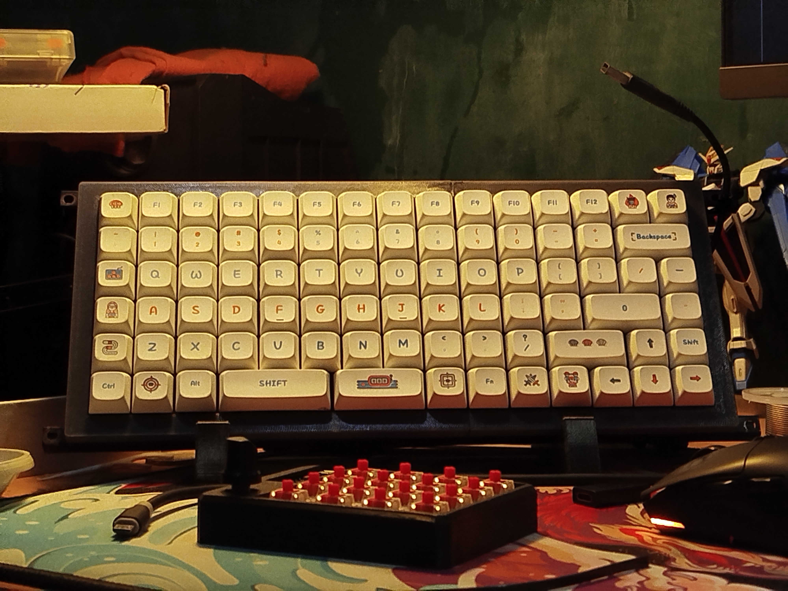
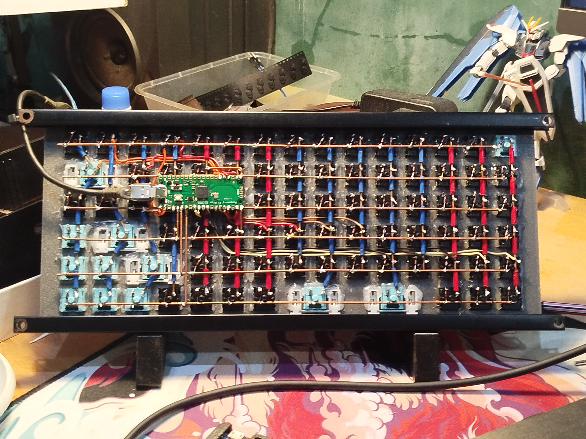
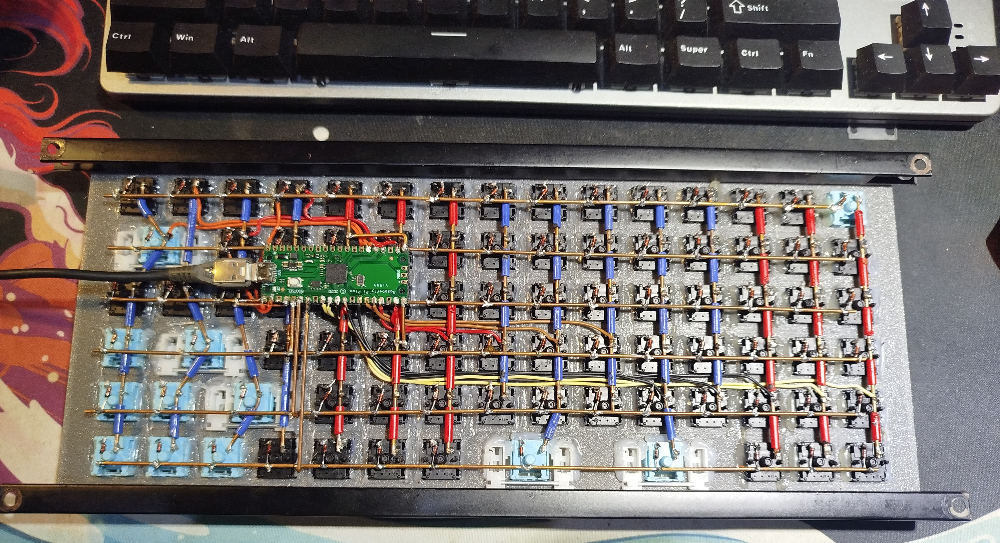

# Klandestin84

Handwired RP2040 ortholinear84 Keyboard Project

## Keyboard Layout Preview

## Keyboard Wiring Preview

## VIA Support

*A short description of the keyboard/project*

* Keyboard Maintainer : [Alif Faizin](https://github.com/katakbersayap)
* Hardware Supported : [*Raspberry Pi Pico RP2040*](https://www.raspberrypi.com/products/raspberry-pi-pico/)
* Firmware: *QMK Firmware*
* Layout : *Custom (ortholinear / handwired)*

## Matrix Pins:
Columns : 
`["GP6","GP7","GP8","GP9","GP10","GP11","GP12","GP13","GP14","GP15","GP16","GP17","GP18","GP19","GP20"]`

Row : 
`["GP0","GP1","GP2","GP3","GP4","GP5"]`

## Flashing Firmware :
1. Compile firmware using [QMK MSYS](https://msys.qmk.fm/)
2. Put RP2040 (Pi Pico) into bootloader mode
3. copy the generated `.uf2` file into the RP2040 (Pi Pico) drive

## Notes
* Ensure matrix wiring matches your QMK configuration
* Donwload Klandestin84 file and copy to `qmk_firmware/keyboard` folder : 
* Use the command 
  
Default Compile:

    qmk compile -kb <keyboard folder name> -km default

via Compile:

    qmk compile -kb <keyboard folder name> -km via

See the [build environment setup](https://docs.qmk.fm/#/getting_started_build_tools) and the [make instructions](https://docs.qmk.fm/#/getting_started_make_guide) for more information. Brand new to QMK? Start with our [Complete Newbs Guide](https://docs.qmk.fm/#/newbs).

## Bootloader

Enter the bootloader in 3 ways:

* **Bootmagic reset**: Hold down the key at (0,0) in the matrix (usually the top left key or Escape) and plug in the keyboard
* **Physical reset button**: Briefly press the button on the back of the PCB - some may have pads you must short instead
* **Keycode in layout**: Press the key mapped to `QK_BOOT` if it is available

## Gallery

